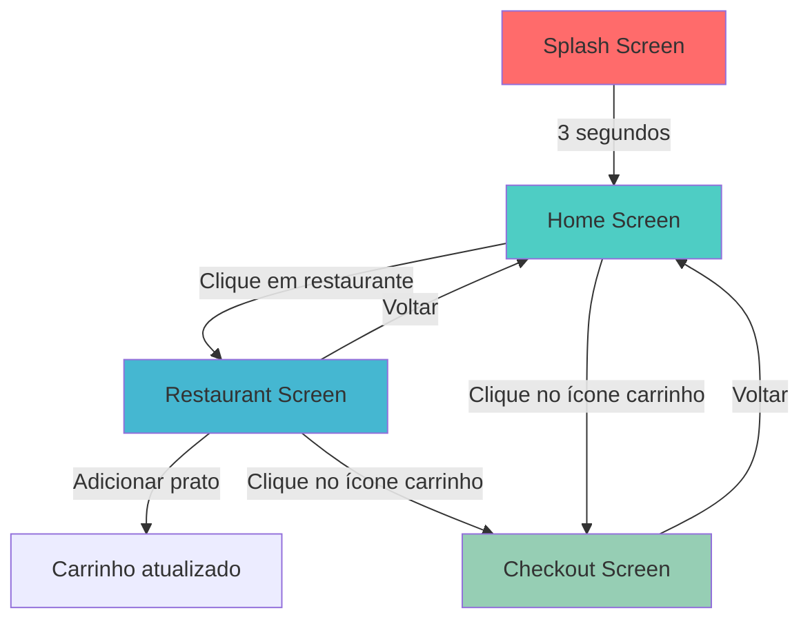
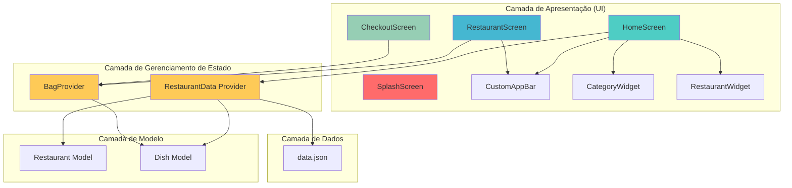
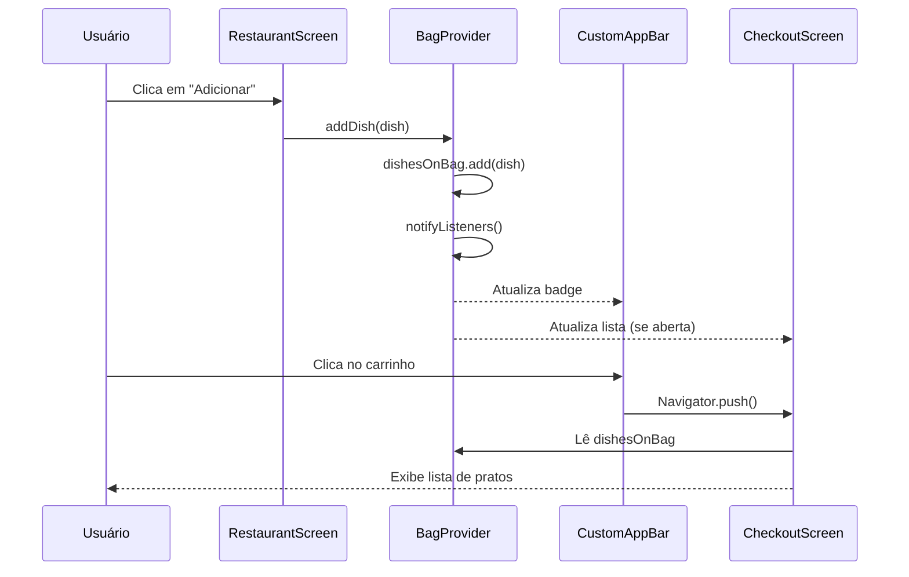
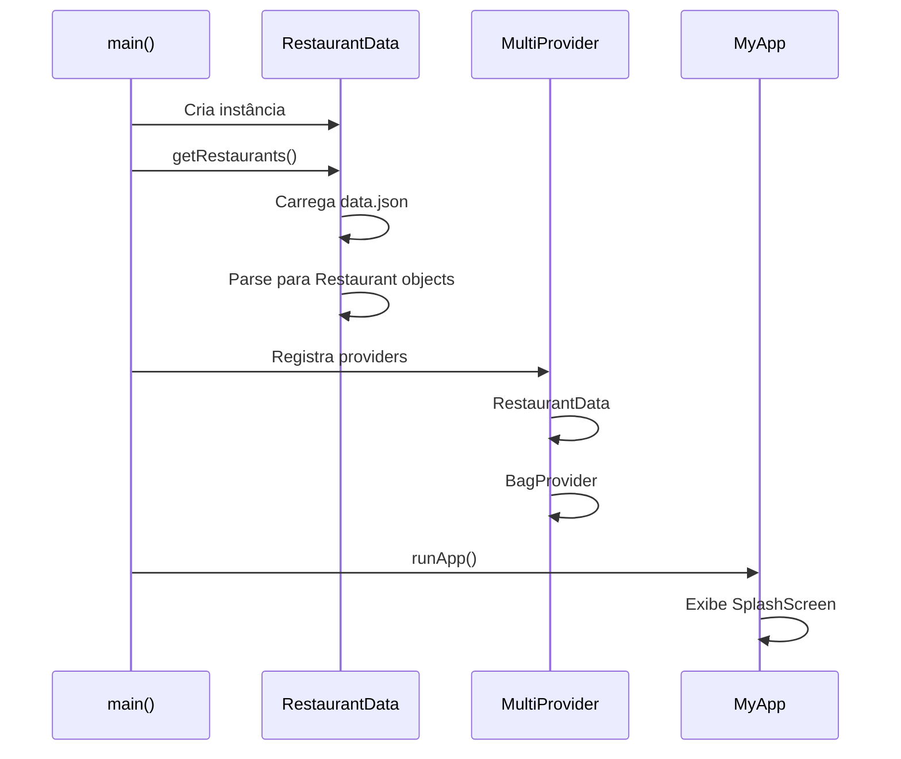

# Tech Taste - Documentação Técnica

## 📋 Índice

1. [Estrutura de Dados](#estrutura-de-dados)
2. [Fluxo de Navegação](#fluxo-de-navegação)
3. [Arquitetura de Componentes](#arquitetura-de-componentes)
4. [API de Dados](#api-de-dados)
5. [Gerenciamento de Estado](#gerenciamento-de-estado)

---

## 📊 Estrutura de Dados

### Restaurant (Restaurante)

Modelo principal que representa um restaurante no aplicativo.

```dart
class Restaurant {
  String id;              // UUID único do restaurante
  String imagePath;       // Caminho para imagem (assets/)
  String name;            // Nome do restaurante
  String description;     // Descrição curta
  double stars;           // Avaliação (0.0 - 5.0)
  int distance;           // Distância em km
  List<String> categories; // Categorias do restaurante
  List<Dish> dishes;      // Cardápio (lista de pratos)
}
```

**Exemplo JSON:**

```json
{
  "id": "b2d171d3-a225-4ee9-8f23-058ed691ef7c",
  "imagePath": "restaurants/monstro-burguer.png",
  "name": "Monstro Burguer",
  "description": "Hambúrgueres para quem curte a madrugada.",
  "stars": 4.3,
  "distance": 2,
  "categories": ["Principais", "Petiscos"],
  "dishes": [...]
}
```

---

### Dish (Prato)

Modelo que representa um prato do cardápio.

```dart
class Dish {
  String id;          // UUID único do prato
  String name;        // Nome do prato
  String description; // Descrição detalhada
  int price;          // Preço em reais (int)
  String imagePath;   // Caminho para imagem (assets/)
}
```

**Exemplo JSON:**

```json
{
  "id": "772c4982-5f51-49c2-b287-3a27d08f93d0",
  "imagePath": "dishes/monstro-burguer/xtudao.png",
  "name": "X-Tudão",
  "description": "O X-Tudão é um prato pensado para...",
  "price": 35
}
```

---

## 🔄 Fluxo de Navegação



### Descrição dos Fluxos

#### 1. **Splash → Home**

- **Duração:** 3 segundos
- **Ação:** Animação de logo + carregamento de dados
- **Dados carregados:** Lista de restaurantes via `RestaurantData`

#### 2. **Home → Restaurant**

- **Trigger:** Clique em card de restaurante
- **Dados passados:** Objeto `Restaurant` completo
- **Tela exibe:** Nome, descrição, cardápio completo

#### 3. **Restaurant → Checkout**

- **Trigger:** Clique no ícone de carrinho (badge)
- **Condição:** Carrinho deve ter pelo menos 1 item
- **Dados:** Lista de pratos via `BagProvider`

#### 4. **Home → Checkout**

- **Trigger:** Clique no ícone de carrinho na AppBar
- **Condição:** Carrinho deve ter pelo menos 1 item
- **Dados:** Lista de pratos via `BagProvider`

---

## 🏗️ Arquitetura de Componentes



### Componentes Principais

#### **UI Components**

| Componente         | Responsabilidade                | Providers Usados |
| ------------------ | ------------------------------- | ---------------- |
| `SplashScreen`     | Tela de abertura com animação   | -                |
| `HomeScreen`       | Lista restaurantes e categorias | `RestaurantData` |
| `RestaurantScreen` | Exibe cardápio do restaurante   | `BagProvider`    |
| `CheckoutScreen`   | Mostra itens do carrinho        | `BagProvider`    |
| `CustomAppBar`     | AppBar com badge do carrinho    | `BagProvider`    |
| `CategoryWidget`   | Card de categoria               | -                |
| `RestaurantWidget` | Card de restaurante             | -                |

#### **State Management**

| Provider         | Tipo             | Responsabilidade                         |
| ---------------- | ---------------- | ---------------------------------------- |
| `RestaurantData` | `ChangeNotifier` | Carrega e armazena lista de restaurantes |
| `BagProvider`    | `ChangeNotifier` | Gerencia carrinho de compras             |

---

## 🔌 API de Dados

### RestaurantData

Provider responsável por carregar os dados dos restaurantes.

```dart
class RestaurantData extends ChangeNotifier {
  List<Restaurant> listRestaurant = [];

  Future<void> getRestaurants() async {
    // Carrega JSON do assets
    String jsonString = await rootBundle.loadString('assets/data.json');
    Map<String, dynamic> data = json.decode(jsonString);
    List<dynamic> restaurantsData = data['restaurants'];

    // Converte para objetos Restaurant
    for (var restaurantData in restaurantsData) {
      Restaurant restaurant = Restaurant.fromMap(restaurantData);
      listRestaurant.add(restaurant);
    }
  }
}
```

**Métodos:**

- `getRestaurants()`: Carrega dados do arquivo JSON

**Propriedades:**

- `listRestaurant`: Lista de todos os restaurantes

---

### BagProvider

Provider responsável pelo carrinho de compras.

```dart
class BagProvider extends ChangeNotifier {
  List<Dish> dishesOnBag = [];

  void addDish(Dish dish) {
    dishesOnBag.add(dish);
    notifyListeners();
  }

  void removeDish(Dish dish) {
    dishesOnBag.remove(dish);
    notifyListeners();
  }

  int get totalItems => dishesOnBag.length;

  int get totalPrice => dishesOnBag.fold(0, (sum, dish) => sum + dish.price);
}
```

**Métodos:**

- `addDish(Dish)`: Adiciona prato ao carrinho
- `removeDish(Dish)`: Remove prato do carrinho

**Getters:**

- `totalItems`: Quantidade total de itens
- `totalPrice`: Valor total do carrinho

---

## 🔄 Gerenciamento de Estado

### Fluxo de Estado com Provider



### Inicialização do App



---

## 📁 Estrutura de Arquivos de Dados

### assets/data.json

Estrutura do arquivo JSON principal:

```json
{
  "restaurants": [
    {
      "id": "uuid",
      "imagePath": "restaurants/nome.png",
      "name": "Nome do Restaurante",
      "description": "Descrição",
      "stars": 4.5,
      "distance": 2,
      "categories": ["Categoria1", "Categoria2"],
      "dishes": [
        {
          "id": "uuid",
          "imagePath": "dishes/restaurante/prato.png",
          "name": "Nome do Prato",
          "description": "Descrição detalhada",
          "price": 35
        }
      ]
    }
  ]
}
```

**Restaurantes disponíveis:**

1. Monstro Burguer (5 pratos)
2. Cabrón Mexicano (5 pratos)
3. Foodcourt Natural (5 pratos)
4. Donutz (5 pratos)
5. Panda Sushi (5 pratos)

**Total:** 5 restaurantes, 25 pratos

---

## 🎨 Categorias Disponíveis

As categorias são definidas em `categories_data.dart`:

```dart
List<String> categories = [
  "Principais",
  "Petiscos",
  "Sobremesas",
  "Bebidas",
  "Massas"
];
```

**Uso:** Filtro visual na HomeScreen (não implementa filtragem funcional ainda)

---

## 🔐 Validações e Regras de Negócio

### Carrinho de Compras

1. **Adicionar item:** Sem limite de quantidade
2. **Remover item:** Remove uma ocorrência por vez
3. **Navegação para Checkout:** Permitida mesmo com carrinho vazio
4. **Cálculo de total:** Soma de todos os preços dos pratos

### Restaurantes

1. **Distância:** Exibida em km (inteiro)
2. **Avaliação:** Escala de 0.0 a 5.0 (double)
3. **Categorias:** Múltiplas categorias por restaurante

---

## 📱 Responsividade

O app é desenvolvido para dispositivos móveis (Android/iOS) com:

- Layout adaptativo para diferentes tamanhos de tela
- Imagens otimizadas em PNG
- Navegação via `Navigator.push/pop`

---

## 🚀 Próximas Melhorias Sugeridas

1. **Filtros funcionais** por categoria
2. **Busca** de restaurantes e pratos
3. **Persistência** do carrinho (SharedPreferences)
4. **Animações** de transição
5. **Backend** para dados dinâmicos
6. **Autenticação** de usuários

---

**Última atualização:** Janeiro 2026  
**Versão:** 1.0.0
